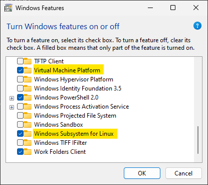
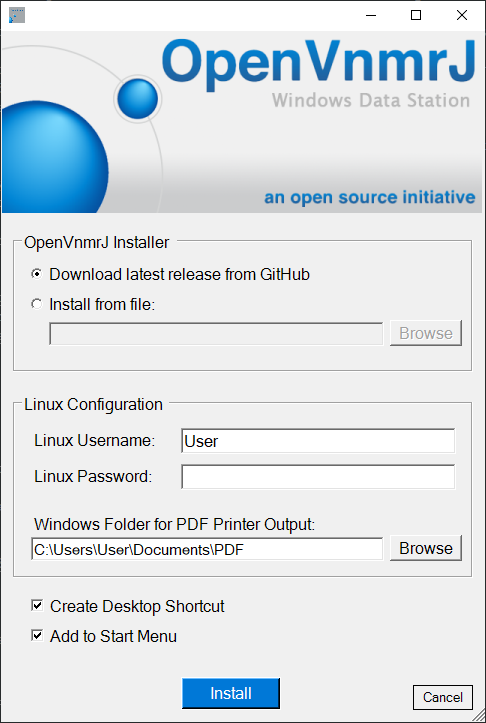
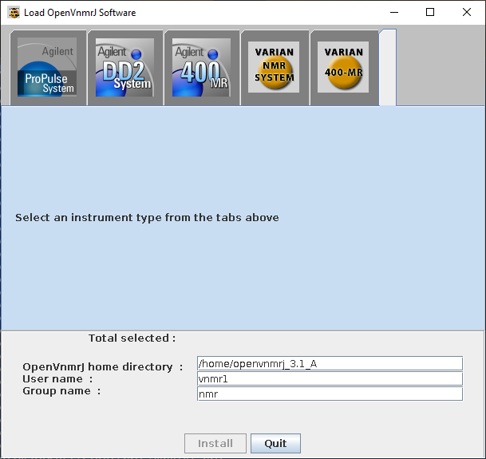
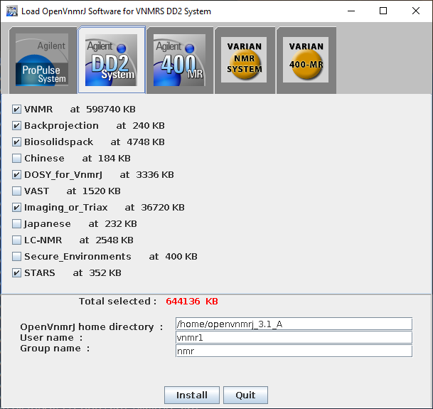
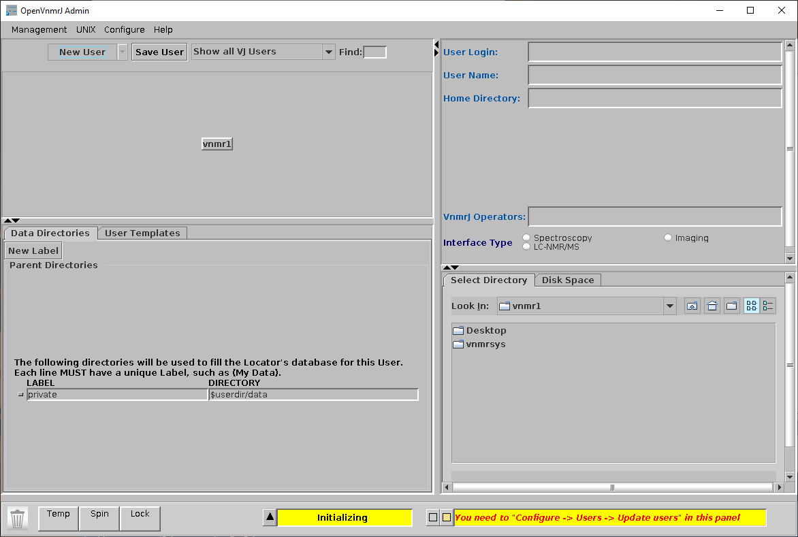
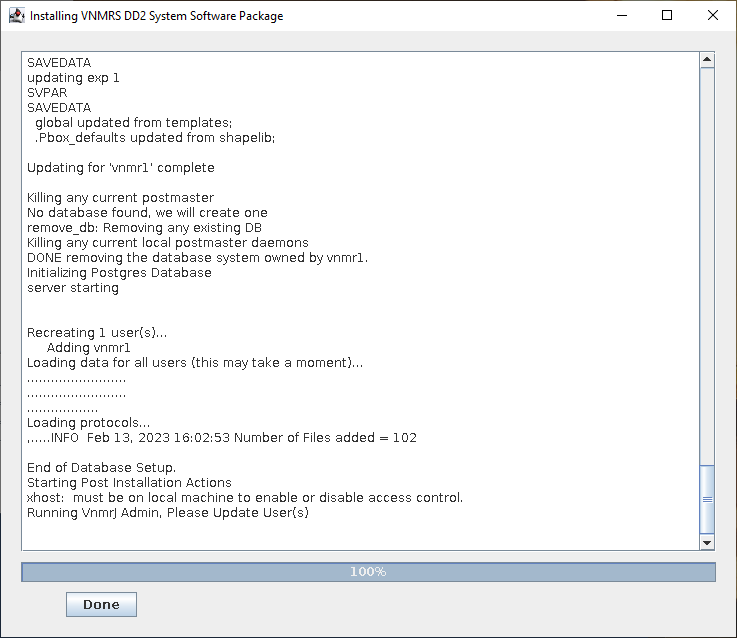
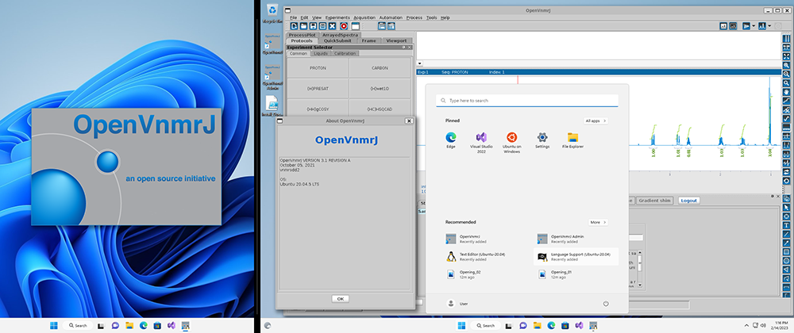
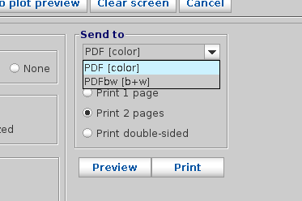

  <a href="https://github.com/JessiBaughman/OpenVnmrJ_WSL/issues/new?assignees=&labels=bug&template=01_BUG_REPORT.md&title=bug%3A+">Report a Bug</a>

 

Table of Contents

- [About](#about)
- [Getting Started](#getting-started)
  - [Prerequisites](#prerequisites)
    - [Administer Privileges](#administer-privileges)
    - [Windows version](#windows-version)
    - [BIOS](#bios)
    - [Windows Features](#windows-features)
  - [Usage / Running the script](#usage--running-the-script)
- [Running OpenVnmrJ](#running-openvnmrj)
  - [Launching OpenVnmrJ](#launching-openvnmrj)
  - [Printing / Plotting](#printing--plotting)
  - [Default PDF Reader](#default-pdf-reader)
  - [Closing OpenVnmrJ](#closing-openvnmrj)
  - [Updating OpenVnmrJ](#updating-openvnmrj)
- [License](#license)

## About
<a href="https://github.com/OpenVnmrJ/OpenVnmrJ">OpenVnmrJ</a> is free and open-source software for processing NMR spectroscopy data. It runs on Ubuntu (20.04, 22.04, 24.04) and Red Hat/Alma (8, 9) Linux distributions as well as macOS 10.13+. This PowerShell script is used to install and configure Windows Subsystem for Linux and OpenVnmrJ on Windows 10+ as an alternative to installing within a virtual machine. WSL provides a native application experience and can result in a smaller installation footprint and faster application startup times.

This script is for installing OpenVnmrJ. If you have already installed OpenVnmrJ to a WSL distro, see the [update section](#updating-openvnmrj) for how to update OpenVnmrJ. Do not use this script for updating.

   

## Getting Started

### Prerequisites

#### Administer Privileges
Some parts of the script will require administrator privileges to install, configure, or update. You will be prompted on the secure desktop each time. 

#### Windows version
To find your version of Windows, open the Settings panel (`Windows + I`) and navigate to System->About.

* **Windows 10** : Version 2004 (aka 20H1, Build 19041, released Spring 2020) or later
	- Version 21H2 (aka Build 19044, released Fall 2021) or later for built-in GUI (WSLg) support
  
* **Windows 11** : Version 21H2 (Build 22000, released Fall 2021) or later

####  BIOS
You will need to enable virtualization in your system BIOS. Entering the BIOS configuration at boot and the label of the virtualization setting itself varies between motherboard manufacturers. You may be able to find detailed instructions by searching your computer model number or manufacturer's name.

#### Windows Features

Two features need to be installed and activated within Windows. These are the "Virtual Machine Platform" and "Windows Subsystem for Linux" features. You can access this panel by searching, "Turn Windows features on or off" from the Start Menu. You will need to reboot your computer after enabling these features.

   

### Usage / Running the script

1. **Unlock the script**
   - Right-click on the .ps1 file and click Properties. Check to see if there is a section at the bottom that reads, "Security: This file came from another computer and might be blocked to help protect this computer." If so, click the Unblock checkbox and click OK.
2. **Start the script**
   - Right-click the .ps1 file and click "Run with PowerShell".
      - If the script fails to run, you may need to bypass the PowerShell execution policy.
        - One time bypass:  
          - Open Run  (right-click the Start Menu and select Run or `Windows+R`)
          - Type: `PowerShell -ExecutionPolicy Bypass -File C:\path\to\script.ps1` with the correct path to the script.
        - Permanent bypass for current user:
          - Open PowerShell and enter: `Set-ExecutionPolicy -ExecutionPolicy RemoteSigned -Scope CurrentUser`
          - Enter `y` at the prompt.
          - Rerun the script.

3. **Fill out the form and click Install**
    - Install from file supports .zip, .tar, and .tar.gz archive files. Archives should decompress to a directory named dvdimageOVJ.
    - The Linux username can differ from your Windows username. However, if you are planning on using a Linux distribution that is already installed, you should enter the default username for that installation.
    - Password is a minimum of 6 characters. If you are planning on using a Linux distribution that is already installed, this should be the default user's password for that distribution.
    - This script will install a PDF printer for OpenVnmrJ so that all prints/plots from the program are saved as PDF files to the Windows directory specified. The entered directory must exist. The Browse button will allow you to create folders as needed.
    - Checkbox selections dictate which, if any, shortcuts to run OpenVnmrJ are created. At least one location is recommended.
	- After clicking the Install button, you will be asked to select which Linux distribution you want to use/install for OpenVnmrJ.
4. **Windows 10 (20H1-21H1) only: Install VcXsrv**
    - The first step will install the <a href="https://sourceforge.net/projects/vcxsrv/">VcXsrv display server</a> if not already present on your system. 
    - This will require elevated privileges first for the install, which will prompt immediately following installer download
    - After installation, you will be notified of an additional elevated prompt request to create a firewall rule for VcXsrv
5. **Main installation**
    - The script will proceed unattended until the OpenVnmrJ graphical installer runs, as pictured below.

6. **Install OpenVnmrJ**
    - Select one of the tabs at the top. For datastations, the selection doesn't matter.
    - Select any additional options if desired.
    -  Click Install. 
    - Note: The dialog may appear slightly off screen. Clicking the window's edge, or resizing the window, will snap it back within the visible desktop space.
    - A second popup will appear with the installation status followed by the OpenVnmrJ Admin panel.

7. **Close the OpenVnmrJ Admin window**
    - You do not need to follow the instructions. Just close the window and everything will be setup automatically later in the script.

8. **Click Done**
9. **Answer the 5 prompts within the PowerShell window**
     - There are five options to select after installing OpenVnmrJ: walkup and service accounts, NMRPipe, manuals, fidlib (sample data), and spectrometer configuration. Enter `n` for the first (accounts) and last (spectrometer) prompt. Enter `y` for any of the middle 3 prompts that you wish installed.
     - The rest of the installation is breif and requires no further interaction.
10. **Press Enter to close the PowerShell window**
     - An installation log is not automatically saved. If you wish to save a log, copy the PowerShell contents before pressing Enter.

   

## Running OpenVnmrJ

### Launching OpenVnmrJ
* The easiest way to launch OpenVnmrJ is to used the created shortcuts. To launch manually:
  * Windows 10 (20H1-21H2): Launch VcXsrv using the "VcXsrv with Xauthority" shortcut in the Start Menu or Run: 
    * `%ProgramFiles%\VcXsrv\vcxsrv.exe -multiwindow -clipboard -wgl -auth "%UserProfile%\.Xauthority"`
  * Open your WSL distribution and type `vnmrj` or `vnmrj admin`

### Printing / Plotting
* Print to file commands will work as expected. File paths are within Ubuntu, so to save to Windows, navigate to `/mnt/c` to access the `C:` drive.
	- If you need to mount other Windows drives within Linux, the `winmount` script [[source](https://pastebin.com/4pjbQmBN)] has been included. Run `winmount x`, where x is the Windows drive letter you wish to mount or unmount. Drives will appear in `/mnt`.
* Output created using the `plot` command will be sent to the PDF printer and saved to the directory selected during install.

* You can toggle between color and grayscale plots by selecting the corresponding version of the PDF printer either from the File->Printers... window or the "Send to" drop-down menu within the Processing->Plot panel.

### Default PDF Reader
* The default PDF reader is set to [Okular](https://github.com/KDE/okular). If you would like to revert to your distribution's default PDF reader, edit or delete the `$HOME/.config/mimeapps.list` file.

### Closing OpenVnmrJ
* OpenVnmrJ can be exited in the standard methods
  * File->Exit VnmrJ, close the window, or type `exit` on the command line
* **Windows 10 (20H1-21H1):** Once closed, you will need to manually exit VcXsrv from the taskbar if desired.

### Updating OpenVnmrJ
* Open a WSL terminal for your distro
	* Open from the distro shortcut in the Start Menu
	* _OR_ run `wsl -d <distro_name> -u vnmr1` from the Command Prompt or PowerShell
* If needed, `su vnmr1`. If you used this script, the vnmr1 password was set to the same as the default WSL account. Use the PowerShell command in the previous step if you have forgotten your vnmr1 password.
* Copy the OpenVnmrJ\*.zip or OVJdvd\*.tar.gz archive of the new OpenVnmrJ release/build to `/tmp/`, `cd` to `/tmp/`, and then expand the file with `unzip` or `tar -xzvf`. 
* Run `cd dvdimageOVJ` followed by `./upgrade.nmr`. 
	* All replaced OpenVnmrJ system files will be located in `/vnmr/adm/upgrade/<current_date>`

## Support

- [Report a bug](https://github.com/JessiBaughman/OpenVnmrJ_WSL/issues/new?assignees=&labels=bug&template=01_BUG_REPORT.md&title=bug%3A+) with the script

- For help with OpenVnmrJ
    - Visit the [OpenVnmrJ GitHub page](https://github.com/OpenVnmrJ/OpenVnmrJ)
    - Join the [IVAN SpinSights](https://ivanmr.com) NMR support group

## License

This project is licensed under the **MIT license**. Feel free to edit and distribute this template as you like.

See [LICENSE](LICENSE) for more information.
